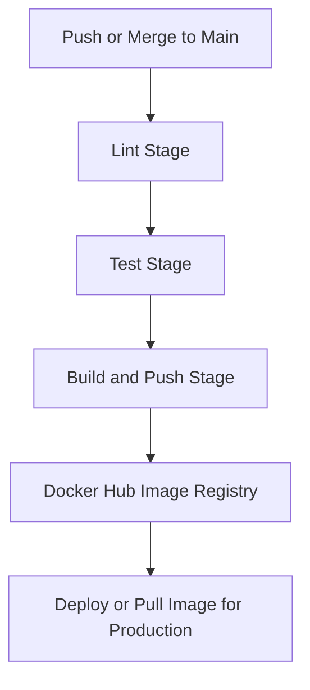

---

# 🧩 DevOps Report — Laravel To-Do Application

**Authors:** Fasih, Saqib, Attique

---

## 🧰 Technologies Used

| Layer                 | Technology            | Description                                                                         |
| :-------------------- | :-------------------- | :---------------------------------------------------------------------------------- |
| **Framework**         | Laravel 10 (PHP 8.2)  | MVC web framework for the application backend and logic.                            |
| **Containerization**  | Docker + Laravel Sail | Simplifies local and CI/CD environment setup with consistent container definitions. |
| **Database**          | MySQL 8.0             | Persistent data storage for to-do tasks.                                            |
| **CI/CD Platform**    | GitHub Actions        | Automates build, test, and deployment workflows.                                    |
| **Image Registry**    | Docker Hub            | Stores and distributes the production-ready Docker image.                           |
| **Testing**           | Laravel PHPUnit       | Automated unit and feature tests executed in CI.                                    |
| **Secret Management** | GitHub Secrets        | Used for securely storing Docker Hub credentials and environment variables.         |

---

## ⚙️ Pipeline Design

**Trigger:**
Any **push or merge to the `main` branch** triggers the CI/CD pipeline.

**Pipeline Stages:**

1. **Lint Job**

   * Checks PHP code formatting and structure (placeholder for Pint).
   * Ensures the codebase is valid before testing.

2. **Test Job**

   * Spins up Laravel Sail containers for the app and MySQL.
   * Configures `.env` dynamically for the CI environment.
   * Runs database migrations and executes Laravel tests.
   * Only proceeds to deployment if all tests pass.

3. **Build and Push Job**

   * Logs in to Docker Hub using GitHub Secrets.
   * Builds a Docker image from `docker/8.2/Dockerfile`.
   * Pushes the image as `username/todoapp:latest` to Docker Hub.

### 🧱 Pipeline Flow Diagram



---

## 🔒 Secret Management Strategy

| Secret Name          | Used In          | Purpose                                 |
| :------------------- | :--------------- | :-------------------------------------- |
| `DOCKERHUB_USERNAME` | Build & Push Job | Authenticates with Docker Hub.          |
| `DOCKERHUB_TOKEN`    | Build & Push Job | Secure access token for pushing images. |

**Strategy:**

* All credentials are stored as **GitHub Repository Secrets** (encrypted at rest).
* The workflow accesses them via `${{ secrets.VARIABLE_NAME }}`.
* No hardcoded credentials are committed to the repository.
* Local developers use `.env` (excluded from Git via `.gitignore`) for their environment variables.

---

## 🧪 Testing Process

1. **Automated Test Execution:**

   * The workflow spins up Laravel Sail containers for both the application and MySQL.
   * Database credentials are replaced dynamically inside `.env` using `sed`.
   * The CI waits for MySQL health before continuing.

2. **Commands Run:**

   ```bash
   ./vendor/bin/sail artisan key:generate
   ./vendor/bin/sail artisan migrate
   ./vendor/bin/sail artisan test
   ```

3. **Validation Steps:**

   * Ensures migrations and seeding succeed.
   * Runs feature and unit tests defined in `/tests`.
   * Fails the pipeline if any test or migration fails.

4. **Artifacts:**

   * Optionally, logs can be retained via GitHub Actions for debugging failed builds.

---

## 📦 Deployment & Docker Image Management

* The final image is built from `docker/8.2/Dockerfile`.
* It is tagged and pushed to Docker Hub:

  ```
  docker push <username>/todoapp:latest
  ```
* This image can then be deployed to any server or cloud platform supporting Docker.

---

## 🧭 Lessons Learned

* **CI/CD Integration:** Automating tests and builds ensures consistent quality and reduces manual effort.
* **Container Consistency:** Laravel Sail simplified running the same environment locally and in CI.
* **Secret Management:** Using GitHub Secrets prevented exposing sensitive credentials in commits.
* **Dependency Isolation:** Docker volumes and networks allowed MySQL and app containers to run independently.
* **Improvement Opportunities:**

  * Add caching to Composer installs to speed up builds.
  * Add Laravel Pint for actual linting.
  * Integrate a staging deployment job triggered after successful builds.

---

✅ **Final Outcome:**
A robust, fully automated CI/CD pipeline for a containerized Laravel To-Do application — linted, tested, and deployed via GitHub Actions and Docker Hub.

---

